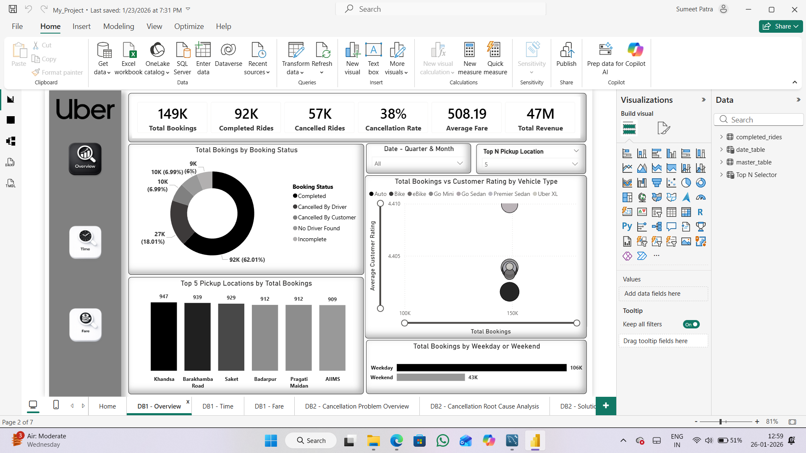
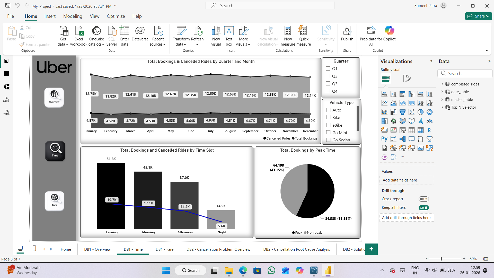
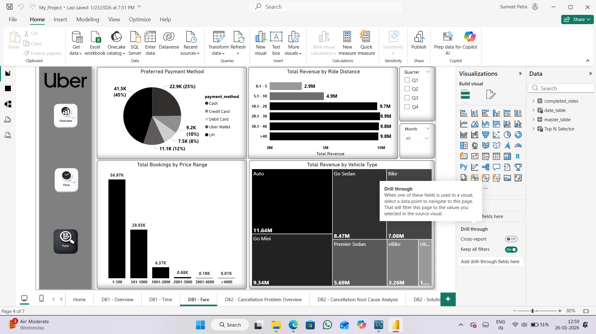

# Uber Ride Data Analysis | Power BI Dashboard

## Project Overview
This project analyzes Uber ride booking data to understand **booking behavior, revenue patterns, and operational efficiency**.

The analysis initially started as a **general exploratory study**. During exploration, a critical issue was identified — a **high ride cancellation rate (~38%)**.  
Based on this insight, the project was extended into a focused **Cancellation Analysis & Optimization Study**.

Both phases are implemented within a **single Power BI file**, logically divided into:
- **DB1 – Exploratory Analysis**
- **DB2 – Cancellation Analysis & Optimization**

---

## Business Problem
A significant percentage of ride bookings were being cancelled, leading to:
- Revenue loss  
- Poor customer experience  
- Inefficient driver utilization  

### Project Objectives
- Identify cancellation patterns  
- Understand root causes of cancellations  
- Propose data-driven solutions to reduce cancellation rates  

---

## Dataset
- Uber ride booking data (CSV / Excel)
- Includes booking details, timestamps, fare, vehicle type, payment method, ratings, and cancellation information
- Dataset access link is provided in the repository

---

## Data Cleaning, Preparation & Feature Engineering

Before building dashboards, the dataset was cleaned, standardized, and enriched to ensure **accurate and reliable analysis**.

---

## A. Data Cleaning

### 1. Column Standardization
- Renamed columns for consistency and readability  
  - Example: `Booking ID` → `booking_id`
- Followed **snake_case naming convention**

### 2. Data Type Validation
- Verified and corrected data types for:
  - Date & time columns  
  - Numerical columns (fare, distance, ratings)  
  - Categorical columns (booking status, vehicle type, payment method)

### 3. Handling Missing Values
- **Cancellation-related columns**
  - Replaced `null` values with `0` (indicating no cancellation)
- **Payment Method**
  - Replaced `null` values with `"Unknown"`
- **Numerical columns**
  - `null` values retained as they are analytically meaningful
- **Rating columns**
  - `null` values retained, indicating rides without ratings

### 4. Duplicate Handling
- Removed duplicate records using `booking_id`
- Ensured **one record per booking**

### 5. Creation of Analysis-Ready Tables
- Created a **Completed Rides Only** table:
  - Filtered `booking_status = "Completed"`
  - Removed cancellation-related columns (optional)
- Used for:
  - Revenue analysis  
  - Distance analysis  
  - Driver and customer rating analysis  

---

## B. Feature Engineering (New Columns)

| Column Name | Creation Method | Purpose |
|------------|----------------|--------|
| `day_name` | Date → Name of Day | Weekday-wise analysis |
| `is_weekend` | Conditional Column | Weekend vs weekday comparison |
| `hour` | Time → Hour | Hourly demand analysis |
| `peak_not_peak` | Custom Column (M Code) | Peak vs non-peak identification |
| `ride_time_slot` | Custom Column (M Code) | Time-slot based analysis |

---

## C. Date Table Creation
- Created a dedicated **date_table** using **DAX**
- Enabled time intelligence and accurate date-based filtering

---

## D. Data Model Relationships
completed_rides (*) ───────► (1) date_table
master_table (*) ───────► (1) date_table

---

## E. KPI Measures (DAX)

- `total_bookings`
- `completed_rides`
- `cancelled_rides`
- `cancellation_percentage`
- `peak_rides`, `non_peak_rides`
- `total_revenue`
- `average_fare`
- `average_driver_rating`
- `average_customer_rating`
- `avg_requested_ride_distance`
- `avg_completed_ride_distance`
- `weekday_rides`, `weekend_rides`

---

## F. Value Segmentation
- Created `booking_value_bucket` and `bucket_rank` columns in **completed_rides**
- Implemented using **Power Query (M Code)**
- Used for revenue and customer value analysis

---

## Dashboard Structure & Screenshots

### Home Page

---

### DB1 – Exploratory Analysis

#### Overview

#### Time-Based Analysis

#### Fare Analysis

---

### DB2 – Cancellation Analysis & Optimization

#### Cancellation Overview

#### Root Cause Analysis

#### Solution & Optimization Insights

---

## Key Insights
- ~38% of total ride bookings are cancelled
- Driver-side cancellations are higher than customer-side cancellations
- Peak hours and high-demand locations show higher cancellation density
- Economy vehicle types dominate both bookings and cancellations
- Medium-distance rides contribute the most to overall revenue

---

## Recommendations
- Introduce zone- and time-based driver incentive programs
- Improve driver availability during peak hours
- Enhance ETA accuracy and in-app communication
- Optimize surge pricing using demand signals
- Reduce dependency on cash payments

---

## Tools & Technologies
- Power BI  
- DAX  
- Power Query (M Code)  
- Excel / CSV  
- Data Modeling  
- Time Intelligence  

---

## Power BI Dashboard Access
Due to GitHub file size limitations, the `.pbix` file is hosted externally:

https://app.powerbi.com/links/c_8cmFMKdE?ctid=61e6000a-7d75-4846-9c6b-60c345837481&pbi_source=linkShare

---

## Author
**Sumeet Patra**  
Data Analyst | Power BI | SQL | Python
